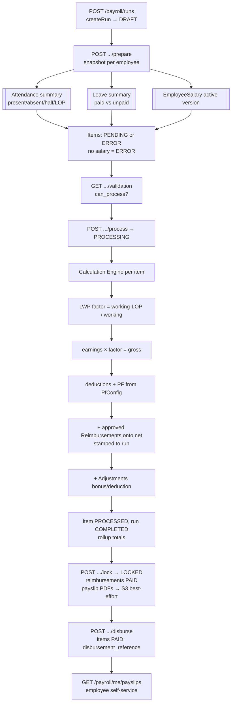
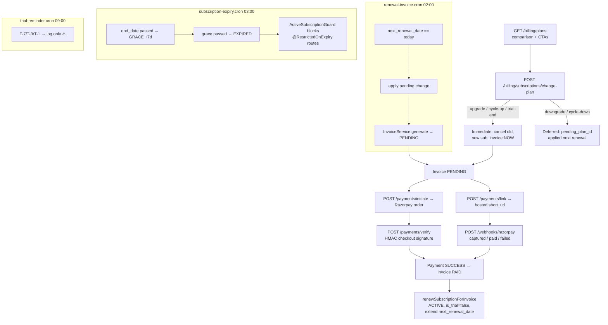
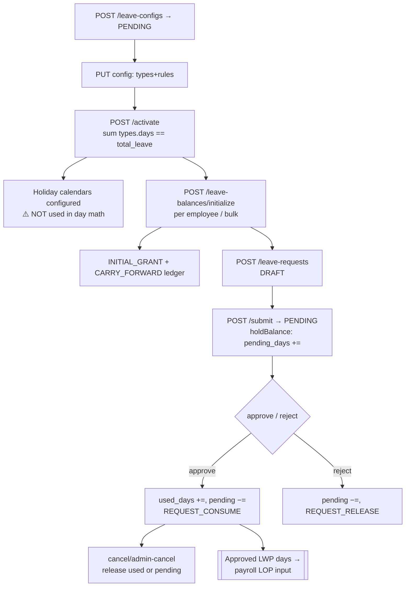
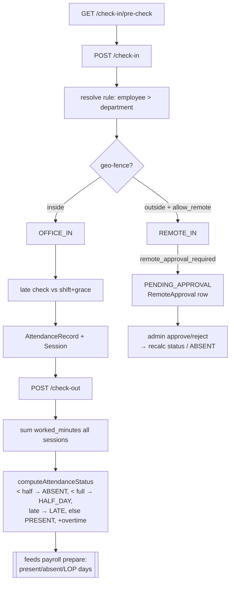
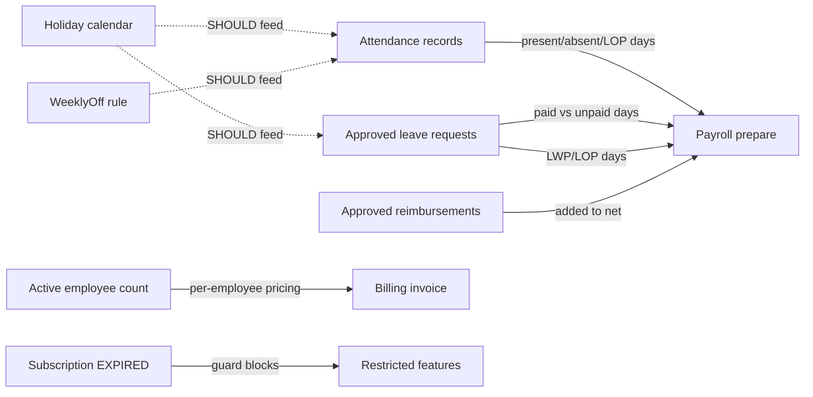

# Brello Server — Flow Validation (Payroll · Billing · Leave · Attendance)

> Validation of the 4 core operational flows: end-to-end behavior, flow diagrams,
> cross-flow impact, and the automation/cron gaps blocking full operability.
> Generated 2026-06-14. Source of truth: `src/modules/*`.

## Existing cron inventory (`@nestjs/schedule`, `ScheduleModule.forRoot()` in `app.module.ts`)

| Cron | Schedule | Module | Status |
|------|----------|--------|--------|
| `renewal-invoice.cron.ts` | `0 0 2 * * *` (02:00) | billing | ✅ Working |
| `subscription-expiry.cron.ts` | `0 0 3 * * *` (03:00) | billing | ✅ Working |
| `trial-reminder.cron.ts` | `0 0 9 * * *` (09:00) | billing | ⚠️ Logs only — no notification wired |
| `payroll-reminder.cron.ts` | midnight | payroll | ⚠️ Mocked — attendance/leave checks hardcoded |
| `offboarding-cron.service.ts` | midnight | user | ✅ (out of scope) |
| `org-setup.cron.ts` | midnight | org-setup | ✅ (out of scope) |
| `otp-cleanup.task.ts` | hourly/midnight | auth | ✅ (out of scope) |
| `search-cleanup.service.ts` | midnight | global-search | ✅ (out of scope) |

**Attendance = 0 crons. Leave = 0 crons.** These two flows are the most automation-starved.

---

## 1) PAYROLL PROCESSING

### Lifecycle
`DRAFT → PREPARE → PROCESS → LOCK → DISBURSE` (run-level), each item `PENDING → PROCESSED | ERROR`, payout `PENDING → PAID`.

Key entities: `PayrollRun`, `PayrollRunItem`, `PayrollRunAdjustment`, `EmployeeSalary(+Component)`, `SalaryTemplate`, `PayrollComponent`, `PfConfig`, `EmployeeStatutoryOverride`, `PayrollSetting`, `PayrollAuditLog`.

### What's missing for full operability
| Gap | Impact | Fix |
|-----|--------|-----|
| **No auto monthly run creation** | HR must manually `POST /payroll/runs` every month | **CRON** (monthly): auto-create DRAFT run per org from `PayrollSetting` |
| `payroll-reminder.cron.ts` mocked (`attendanceNotLocked=true`, `pendingLeaves=2`) | Reminders fire on fake data; no notification sent | Wire real attendance-lock + pending-leave queries + `NotificationService` |
| `attendance_cutoff_type/value` defined but **not applied** | Full calendar month always used; cutoff ignored | Apply cutoff window in `prepare()` |
| `EmployeeStatutoryOverride` entity **unused** | PF exemptions/custom basis not honored | Read overrides in calc engine |
| Disburse is **tracking-only** (no bank/payout gateway) | Funds moved out-of-band; reference manually entered | Optional payout integration |
| Payslip PDF failures swallowed at lock | Missing payslips silently | Retry cron + alerting |
| No approval workflow before lock/disburse | Anyone with permission finalizes instantly | Optional maker-checker |

---

## 2) BILLING

### Lifecycle
Subscription `TRIAL → ACTIVE → GRACE → EXPIRED` (or `CANCELLED`); invoice `PENDING → PAID | FAILED | OVERDUE | CANCELLED`; payment `INITIATED → PROCESSING → SUCCESS | FAILED`. Razorpay via order-checkout **or** hosted payment-link (preferred).

Key entities: `OrganizationSubscription`, `Plan(+PlanApp/PlanModule)`, `Invoice(+InvoiceLineItem)`, `Payment`, `BillingProfile`.

### What's missing for full operability
| Gap | Impact | Fix |
|-----|--------|-----|
| `trial-reminder.cron` logs only (TODO) | Customers get no trial-expiry warning | Wire `NotificationService` email |
| **No OVERDUE transition cron** | PENDING invoices past `due_date` never become OVERDUE | **CRON** (daily): mark PENDING→OVERDUE past due |
| **No dunning / payment retry** | Failed invoices sit dead; no follow-up | **CRON**: retry/dunning reminders on FAILED/OVERDUE |
| **No auto-charge** (manual pay each cycle) | Renewal generates invoice but customer must click pay | Razorpay subscriptions/mandate for true recurring |
| Pending downgrade lost if sub expires before renewal | Silent loss of intended plan change | Apply pending change in expiry cron too |
| No proration on mid-cycle change/headcount delta | Over/under-billing | Proration in `InvoiceService.generate` (override hooks exist) |
| No refund on cancel | Pre-paid period not refunded | Refund flow |
| Crons not transaction-wrapped; all fire 02:00–03:00 | Thundering herd; partial state on crash | Batch + wrap in tx |

---

## 3) LEAVE MANAGEMENT

### Lifecycle
Config `PENDING → ACTIVE`; request `DRAFT → PENDING → APPROVED | REJECTED | CANCELLED`. Balance tracked as `accrued + carry_forward + adjustment − used − pending`, every mutation double-entry in `LeaveBalanceLedger`. LWP type = unlimited/synthetic.

Key entities: `LeaveConfig`, `LeaveType`, `LeaveRules`, `LeaveBalance(+Ledger)`, `LeaveRequest(+History)`, `HolidayCalendar(+Holiday)`.

### What's missing for full operability
| Gap | Impact | Fix |
|-----|--------|-----|
| **No monthly accrual cron** | `accrual='monthly'` types computed once at init, never grow | **CRON** (monthly 1st): increment `accrued_days`, ledger `MONTHLY_ACCRUAL` |
| **No year-end carry-forward/lapse cron** | Carry-forward is manual; unused days never lapse; next-year balance not created | **CRON** (01-Jan): compute available, apply lapse cap, open next-year balance |
| **No new-joiner auto-init** | Balances only via manual API; new hires have none until someone runs it | Hook on employee→ACTIVE, or daily catch-up cron |
| **Holidays not integrated in day math** (`leave-request.service.ts:1164`, breakdown `holidays=0`) | Employee loses a leave day for holidays inside the range | Subtract holiday-calendar days in `computeBreakdown()` |
| No notifications on submit/approve/reject | Approvers/employees unaware | Wire `NotificationService` |
| No encashment feature | N/A if not required | Build if needed |

---

## 4) CHECK-IN / CHECK-OUT (ATTENDANCE)

### Lifecycle
Pre-check → check-in (geo-fence, late calc, optional remote-approval) → multiple sessions → check-out (worked minutes → status). Status set live: `PRESENT / LATE / HALF_DAY / ABSENT / PENDING_APPROVAL / OVERTIME`. **`ON_LEAVE / HOLIDAY / WEEKLY_OFF / MISSED_CHECKOUT` exist in the enum but are never auto-set.**

Key entities: `AttendanceRecord`, `AttendanceSession`, `Shift`, `AttendanceRule`, `WeeklyOff`, `GeoFence`, `RuleAssignment`, `RemoteApproval`, `AttendanceAuditLog`.

### What's missing for full operability — biggest cron gap
| Gap | Impact | Fix |
|-----|--------|-----|
| **No end-of-day auto-absent** | No-shows leave no record; payroll under-counts LOP | **CRON** (nightly ~23:55): create ABSENT for working-day no-shows |
| **No auto-checkout** (`shift.auto_checkout_time` unused) | Forgotten punches leave sessions open forever | **CRON**: auto-close open sessions past auto-checkout, source=AUTO |
| **`WEEKLY_OFF` / `HOLIDAY` / `ON_LEAVE` never set** | Off-days look like absences; payroll working-day math wrong | **CRON** (daily): stamp weekly-off (from `WeeklyOff`), holidays (from `HolidayCalendar`), approved leave (from `LeaveRequest`) onto records |
| **`MISSED_CHECKOUT` never auto-assigned** | Open sessions not flagged | Same nightly cron |
| **No monthly summary rollup** (`dailySummary()` exists but uncalled) | Payroll recomputes from raw rows each run; no audit snapshot | **CRON** (month-end): rollup working/present/paid-leave/LOP per employee |
| `geo_violations` hardcoded 0 in summary | Geo abuse invisible | Aggregate real rejections |

---

## Cross-flow impact map

**The critical coupling:** Payroll correctness depends entirely on attendance & leave producing correct *payable days*. Today attendance does **not** mark weekly-offs, holidays, leave, or no-shows automatically, and leave does **not** exclude holidays — so payroll's `total_working_days` / `lop_days` are unreliable until the attendance + leave crons below exist. **Fix attendance/leave automation first, then payroll auto-run.**

---

## Priority cron backlog (what to add, in order)

1. **Attendance — nightly reconciler (~23:55)** ⭐ highest leverage
   - auto-checkout open sessions; mark WEEKLY_OFF / HOLIDAY / ON_LEAVE / ABSENT / MISSED_CHECKOUT.
2. **Leave — monthly accrual (1st)** + **year-end carry-forward/lapse (01-Jan)** + new-joiner init.
3. **Leave — holiday integration** in `computeBreakdown()` (logic fix, not a cron, but blocks correct LOP).
4. **Attendance — month-end summary rollup** feeding payroll snapshots.
5. **Payroll — monthly auto-run creation** + de-mock `payroll-reminder.cron`.
6. **Billing — invoice OVERDUE transition** + **dunning/retry** + finish `trial-reminder` notifications.
7. **Cross-cutting — wire `NotificationService`** into leave/payroll/billing/attendance events.
